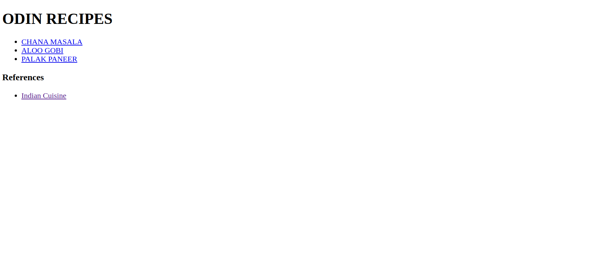
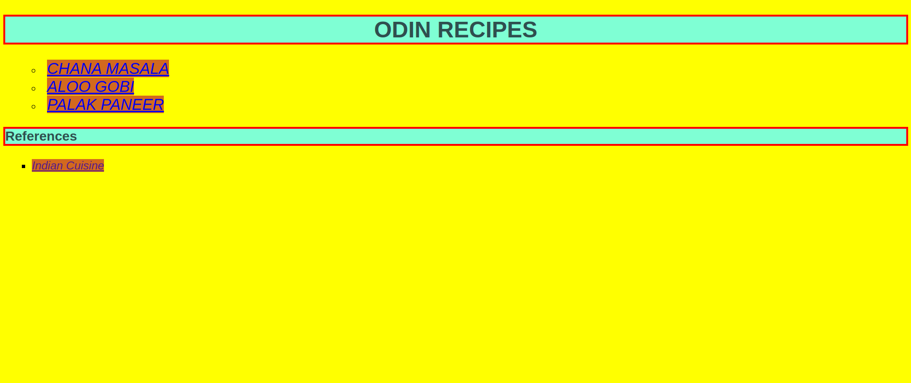
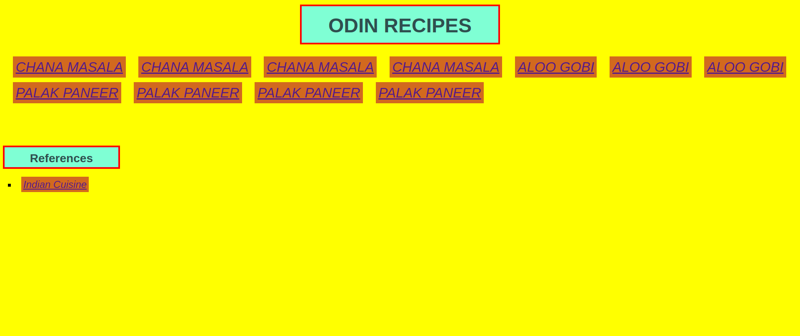

# odin-recipes

This is my first project. I have only learnt basic HTML so far
so this will be a very simple project. 
I will only use basic HTML elements in this. 
I am also learning how to commit atomic changes to the main 
git repository with appropriate messages.

Using basic css properties and the cascade to style the page.

Using box-sizing and display properties for better layout.

link: https://chinmay0303.github.io/01_odin-recipes/index.html
